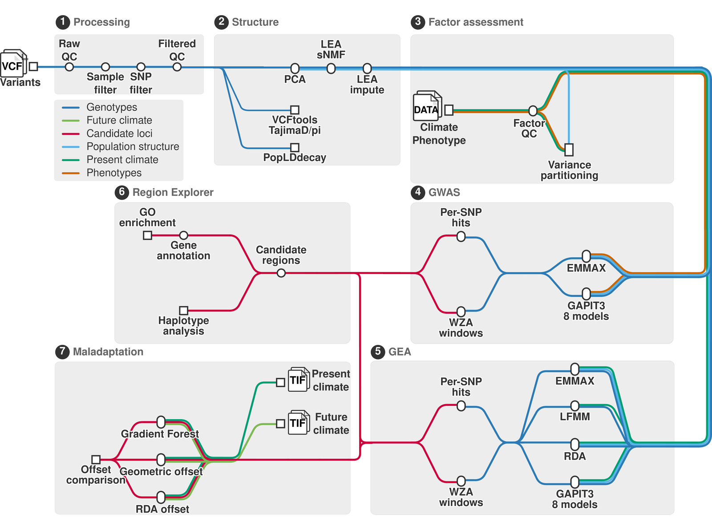

  

  <b>C</b>onservation-oriented <b>L</b>andscape-genomic <b>IN</b>ference of
  <b>E</b>nvironment-association and <b>G</b>enomic <b>O</b>ffset

---

A pipeline for finding the genetic basis of local adaptation, and for asking what climate
change will cost it.

Starting from a filtered VCF and the coordinates of your sampling sites, CLINE-GO resolves
population structure, tests every SNP for association with the environment your populations
actually live in — or with traits you measured — and turns the significant hits into genomic
regions, genes and enriched functions. It then projects those adaptive loci onto future
climate to estimate **genomic offset**: how far each population would be from the genotype
its environment will demand, and therefore which populations are most at risk.

## What you provide

- A **VCF** of biallelic SNPs
- A **metadata TSV** — `site`, `sample`, `latitude`, `longitude`, plus any measured trait
  columns
- Optionally a **GFF3** for gene annotation and GO enrichment

Everything else ships in one Docker image, and present-day and future climate rasters are
downloaded for you. Coordinates are needed for the environmental half; a phenotype-only run
without them is supported.

## What it does

- **Processing** — filtering, LD pruning, chromosome normalization, and QC over missingness,
  heterozygosity, MAF, SNP density and relatedness.
- **Population structure** — PCA and sNMF ancestry coefficients across a range of *K*, with
  cross-entropy to choose it, and ancestry mapped onto sampling sites.
- **Environment and traits** — predictor correlation and density, detection of predictors
  invariant across sites, dbMEM spatial eigenvectors, and variance partitioning between
  climate, structure and geography. Trait characterization runs with or without coordinates.
- **Hyperparameter exploration** *(optional)* — sweeps LFMM *K*, EMMAX principal components
  and RDA `Condition()` components on the cheap LD-pruned data, and reports one recommended
  value per method before committing to the expensive full-SNP run.
- **Association** — **EMMAX**, **LFMM**, **RDA** and eight **GAPIT** models (GLM, MLM, CMLM,
  ECMLM, SUPER, MLMM, FarmCPU, BLINK), run against climate predictors or against measured
  traits, then clustered into regions, annotated with genes, and tested for GO enrichment.
- **Overlap** — where environmental and phenotypic signal coincide, per trait pair.
- **Maladaptation** — genomic offset under CMIP6 future scenarios via **Gradient Forest**,
  **geometric offset**, and **RDA offset** in uncorrected and structure-corrected form.
- **Interactive viewer** — a Shiny dashboard over every result, computing regional plots, GO
  enrichment and haplotype analysis on demand.

## Pipeline at a glance

  

## Status

CLINE-GO is **under active development**. Interfaces, configuration keys and output layouts
may still change between commits. **A publication describing the method is in preparation.**
